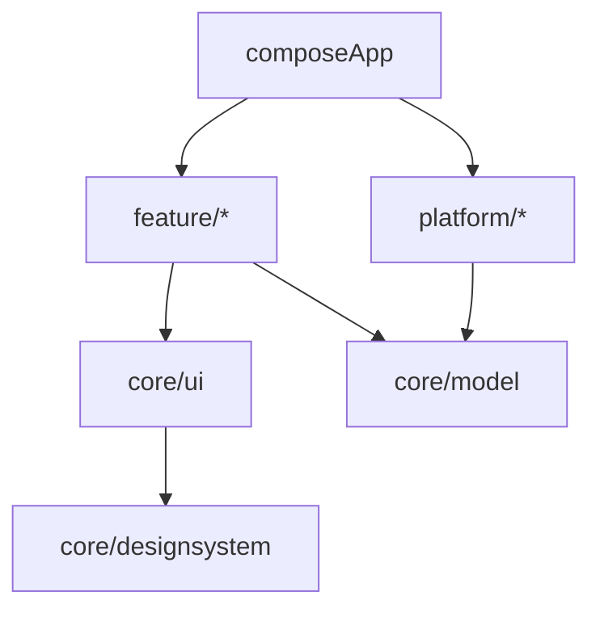

# 모듈 경계

> 상태: Accepted
> SSOT: Git Repository
> 원본: [Architecture v1](overview.md)
> 최종 검토일: 2026-09-10

ICEC는 프로젝트 규모에 맞는 목적 중심 모듈화를 사용합니다.

```text
composeApp

core/
  designsystem
  ui
  model

feature/
  home
  gallery
  editor
  result

platform/
  image
  face-detection
  media
```

## 책임

- `composeApp`: 애플리케이션 진입점, 공통 back stack과 전체 의존성 조립.
- `core/designsystem`: Compose로 표현되는 디자인 토큰과 재사용 컴포넌트 계약.
- `core/ui`: 여러 feature에서 실제로 공유하는 UI 기반 요소.
- `core/model`: 플랫폼 독립 공통 모델.
- `feature/*`: 기능별 화면, `Action`, `UiState`, `Effect`, ViewModel과 UI 로직.
- `platform/*`: Android/iOS SDK, 이미지 타입, 권한과 저장 API 같은 네이티브 기능 경계.

## 의존성 규칙



- feature 사이에는 직접 의존성을 만들지 않습니다.
- feature는 플랫폼 구현체 대신 `platform/*`이 제공하는 공통 계약에 의존합니다.
- 공통 back stack과 feature 연결은 `composeApp`이 조립합니다.
- 패키지는 모듈의 목적을 반영하고, 초기에는 불필요한 `data/domain/presentation` 하위 계층을 만들지 않습니다.
- 파일 수와 변경 이유가 실제로 분리될 때만 모듈 또는 하위 패키지를 추가합니다.
