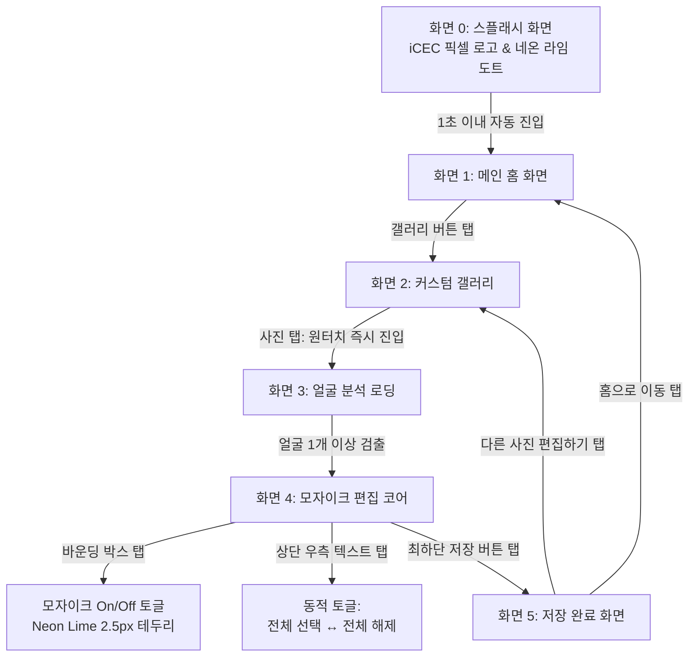
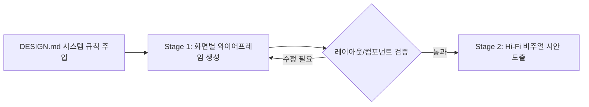

# 🎨 [Legacy] ICEC UI/UX & Stitch AI DESIGN.md

> **상태**: Legacy Reference
> **SSOT 아님**: 최신 UX 정책은 Notion, 승인된 시각 디자인은 Figma를 확인합니다.
> **보존 목적**: Stitch 기반 초기 디자인 방향과 프롬프트 이력을 보존합니다.

> **과거 상위 기획서**: [ICEC UI/UX 디자인 기획서](https://app.notion.com/p/3d34d984a218818da3b8fa6956fb1796)
> **제품 PRD**: [ICEC 제품 요구사항 정의서(PRD)](https://app.notion.com/p/3d34d984a2188170bf31c07223f05a15)  
> **피그마 프로젝트**: [ICEC Figma Project (Node #10:4803)](https://www.figma.com/design/K8uqTjJDkBnC1lNxfuICv0/ICEC?node-id=10-4803&t=IWYJQ8iMXDYp9o58-1)  
> **문서 식별자**: `DOC-STITCH-DESIGN-MD-v2.1`  
> **적용 툴**: [Stitch with Google](https://stitch.withgoogle.com/)  
> **타겟 플랫폼**: Mobile Android (9:16 Viewport)  
> **핵심 컨셉**: `Pure Black (#000000)` + `8-bit Pixel Typo` + `Neon Lime (#E6FA00)` 극미니멀 사이버-실용주의  
> **기획 핵심 방향**: **코드 제외**, **와이어프레임 및 디자인 기획 집중**, **카드/뱃지 배제**, **부가 텍스트/장식 최소화**

---

## 📌 목차
1. [핵심 디자인 원칙 (Core Principles: Anti-Card & Minimalist)](#1-핵심-디자인-원칙-core-principles-anti-card--minimalist)
2. [전체 화면 흐름도 (Screen Flow & Journey)](#2-전체-화면-흐름도-screen-flow--journey)
3. [컬러 팔레트 및 시맨틱 역할 (Color Palette & Tokens)](#3-컬러-팔레트-및-시맨틱-역할-color-palette--tokens)
4. [타이포그래피 규칙 (Typography Rules)](#4-타이포그래피-규칙-typography-rules)
5. [독립 컴포넌트 인벤토리 (Component Inventory)](#5-독립-컴포넌트-인벤토리-component-inventory)
6. [공간 및 레이아웃 원칙 (Spatial & Layout Principles)](#6-공간-및-레이아웃-원칙-spatial--layout-principles)
7. [Stitch 2단계 워크플로우: 와이어프레임 → 시안 도출](#7-stitch-2단계-워크플로우-와이어프레임--시안-도출)
8. [Stage 1: 화면별 와이어프레임 프롬프트 (Wireframe / Lo-Fi)](#8-stage-1-화면별-와이어프레임-프롬프트-wireframe--lo-fi)
9. [Stage 2: 화면별 실전 비주얼 시안 프롬프트 (Hi-Fi Production)](#9-stage-2-화면별-실전-비주얼-시안-프롬프트-hi-fi-production)
10. [화면별 프롬프트 한국어 번역 및 상세 가이드](#10-화면별-프롬프트-한국어-번역-및-상세-가이드)
11. [확정 UI 디자인 시안 모음 (Design Mockups)](#11-확정-ui-디자인-시안-모음-design-mockups)

---

## 1. 핵심 디자인 원칙 (Core Principles: Anti-Card & Minimalist)

Stitch AI의 고질적인 과도한 카드 컨테이너 생성과 부가 텍스트 남발을 방지하기 위해 다음 4대 원칙을 철저히 강제합니다:

1. **Anti-Card & Anti-Badge (카드/뱃지 UI 최소화)**
   * 배경 위에 불필요한 둥근 모서리의 카드 컨테이너(Card Wrapper)를 중첩하지 않습니다.
   * 상태 정보는 캡슐형 뱃지(Pill Badge) 대신 **플랫한 텍스트 형태(`검출 5 / 모자이크 2`, `1,240장`)**로 직관적으로 표기합니다.
2. **Zero-Fluff Copy & Minimal Icons (부가 설명 전면 제거)**
   * "100% 온디바이스 AI 분석", "얼굴을 터치하여 가리기" 등의 기능 과시형 설명 텍스트를 제거합니다.
   * 사용자의 시선이 사진과 실제 작업 대상(얼굴 바운딩 박스)에 100% 집중되도록 텍스트는 오직 명사형 타이틀과 액션 라벨만 허용합니다.
3. **Pure Action-Oriented (명확한 원탭 인터랙션)**
   * 갤러리 사진 선택 시 불필요한 체크 선택 모드 없이 **탭 즉시 분석 화면으로 쾌속 전환**합니다.
   * 공유 플로우를 생략하고 `다른 사진 편집하기`와 `홈으로 이동`만 심플하게 배치합니다.
4. **Wireframe-First Flow (와이어프레임 선행 원칙)**
   * 복잡한 스타일링 이전에 화면 뼈대(구조, 비율, 터치 영역)를 와이어프레임으로 검증한 후 컬러 및 그래픽 시안을 도출합니다.

---

## 2. 전체 화면 흐름도 (Screen Flow & Journey)



---

## 3. 컬러 팔레트 및 시맨틱 역할 (Color Palette & Tokens)

| 토큰명 (Token) | HEX 코드 | 배분 비율 | 시맨틱 역할 및 가이드라인 |
| :--- | :--- | :--- | :--- |
| **Absolute Obsidian Black** | `#000000` | 60% (Base) | 캔버스 베이스, 메인 배경, 앱 아이콘 배경. 불필요한 배경 레이어링 금지. |
| **Deep Charcoal Surface** | `#121212` | 30% (Surface) | 갤러리 그리드 배경 등 필수적인 영역 구분용 서피스. |
| **Elevated Studio Slate** | `#1E1E1E` | 30% (Bars) | TopAppBar 및 최하단 액션 영역의 플랫한 바탕색. (카드 박스 용도 지양) |
| **Tactical Border Hairline** | `#333333` | Border | 1px 미세 구분선 (상/하단 바 경계선 전용). |
| **Electric Neon Lime** | `#E6FA00` | 10% (Key Accent) | **메인 CTA 버튼(저장, 갤러리)**, 모자이크 활성 테두리, 픽셀 도트. |
| **Cyber Cyan Blue** | `#3098FF` | Sub Accent | 미선택 얼굴 바운딩 박스 가이드라인. |
| **Crisp Signal White** | `#FFFFFF` | Primary Text | 타이틀, 8-bit 워드마크 `iCEC`, 메인 아이콘. |
| **Muted Tactical Slate** | `#A8A8A8` | Secondary Text | 단순 수량/상태 표시 텍스트(`1,240장`, `검출 5 / 모자이크 2`). |
| **Tactical Alert Crimson** | `#EF4444` | Destructive | 상단 우측 `전체 해제` 텍스트 버튼 전용. |

---

## 4. 타이포그래피 규칙 (Typography Rules)

앱의 모든 UI 텍스트는 가독성과 모던한 룩앤필을 극대화하기 위해 **Pretendard (프리텐다드)** 폰트 패밀리를 표준으로 적용하며, 브랜드 로고에만 8-bit 디지털 픽셀 폰트를 예외적으로 사용합니다.

* **기본 시스템 서체 (Primary UI Font)**: **Pretendard** (Regular, Medium, SemiBold, Bold)
  * 전 화면의 헤더, 타이틀, 본문, 상태 표기, 버튼 라벨 등 모든 UI 텍스트에 Pretendard 단일 서체를 통일 적용합니다.
* **Brand Display / Wordmark (예외)**: 8-bit Digital Pixel Monospaced Typeface (`iCEC` 브랜드 로고 전용). 견고하고 각진 레트로 컴퓨팅 픽셀 느낌.
* **Header / Title**: Pretendard Bold (`18sp ~ 20sp`, Line Height `26sp ~ 28sp`).
* **Status & Count (상태 및 수량 표기)**: Pretendard Medium (`14sp`, `#A8A8A8` Muted Slate). (`검출 5 / 모자이크 2`, `1,240장` 등)
* **Action Buttons**: Pretendard Bold (`16sp`, 높이 56dp 버튼 내부).
  * ⚠️ **WCAG AAA Contrast Rule**: Neon Lime (`#E6FA00`) 배경 버튼 내부 글자는 무조건 **`#000000` (Solid Black)** Pretendard Bold를 적용합니다.
* **Body & Captions**: Pretendard Regular / Medium (`12sp ~ 14sp`, Line Height `140%`).

---

## 5. 독립 컴포넌트 인벤토리 (Component Inventory)

화면별로 재사용되는 핵심 UI 컴포넌트들을 규격화하여 정리한 인벤토리입니다:

### 5.1 TopAppBar (상단 앱바)
* **공통 규격**: 높이 `56dp`, 배경 Studio Slate (`#1E1E1E`) 또는 Pure Black (`#000000`), 하단 1px 보더 (`#333333`).
* **갤러리 앱바 (`TopAppBar_Gallery`)**:
  * 좌측: 뒤로가기 네비게이션 아이콘 (White `#FFFFFF`).
  * 중앙: 화면 타이틀 "사진 선택" (White `#FFFFFF` 18sp Bold).
  * 우측: **단순 수량 텍스트** `1,240장` (Muted Slate `#A8A8A8` 14sp, 뱃지 박스 없음).
* **편집기 앱바 (`TopAppBar_Editor`)**:
  * 좌측: 뒤로가기 네비게이션 아이콘.
  * 중앙: **단순 상태 텍스트** `검출 5 / 모자이크 2` (Muted Slate `#A8A8A8` 14sp, 뱃지 박스 없음).
  * 우측: **토글형 텍스트 버튼** (박스 없이 순수 텍스트만)
    * 모자이크가 0개일 때: `전체 선택` (Neon Lime `#E6FA00` 또는 White `#FFFFFF`).
    * 모자이크가 1개 이상일 때: `전체 해제` (Alert Crimson `#EF4444`).

### 5.2 Action Buttons (액션 버튼)
* **Primary Button (`IcecPrimaryButton`)**:
  * 규격: 높이 `56dp`, 모서리 `12dp` 라운딩, 전폭(Full Width).
  * 색상: Electric Neon Lime (`#E6FA00`) 배경 + Black (`#000000`) 16sp Bold 텍스트.
  * 용도: 홈 `갤러리`, 편집기 최하단 `저장`, 완료 화면 `다른 사진 편집하기`.
* **Secondary Outlined Button (`IcecSecondaryButton`)**:
  * 규격: 높이 `56dp`, 모서리 `12dp` 라운딩, `1.5px` Neon Lime 테두리, 투명 배경.
  * 색상: Neon Lime (`#E6FA00`) 16sp Bold 텍스트.
  * 용도: 완료 화면 `홈으로 이동`.

### 5.3 Photo Grid & Viewport (미디어 뷰포트)
* **커스텀 갤러리 그리드 (`MediaPhotoGrid`)**:
  * 3열 정사각 타일, 간격 `2dp`.
  * **절대 금지**: 사진 썸네일 위에 체크박스, 선택 뱃지, 번호, 오버레이 아이콘 등 일체의 그래픽 요소를 표시하지 않음.
  * 동작: 사진 탭 즉시 얼굴 분석 로딩 화면으로 직행.
* **편집기 사진 캔버스 (`EditorCanvas`)**:
  * 완전한 Pure Black 배경 위에 사진 원본 중앙 배치.
  * 멀티터치 핀치 줌 & 팬 지원.

### 5.4 Face Bounding Box & Mosaic (얼굴 가이드 및 모자이크)
* **미선택 얼굴 가이드 (Inactive)**:
  * 외곽선: `1.5px` Cyber Cyan Blue (`#3098FF`), 모서리 `6dp`.
  * 내부: 원본 사진 100% 노출.
* **선택 얼굴 모자이크 (Active Mosaiced)**:
  * 내부: 정사각 `16x16` 픽셀 모자이크 블러.
  * 외곽선: `2.5px` 발광 Electric Neon Lime (`#E6FA00`) 테두리.
  * 뱃지: 우측 상단 `20dp` 원형 Neon Lime 체크마크 (`✓`).
* **인터랙션**: 사용자가 표시된 바운딩 박스를 직접 터치하여 모자이크 On/Off 토글.

### 5.5 Processing Indicator (로딩 인디케이터)
* **단순 로딩 뷰 (`SimpleLoadingIndicator`)**:
  * 카드 컨테이너 없음. 배경은 사진 블러 + 어두운 틴트.
  * 중앙: 심플한 원형 인디케이터 (Electric Neon Lime `#E6FA00`).
  * 하단 텍스트: "얼굴을 찾는 중..." (White `#FFFFFF` 16sp Bold) 단 한 줄. (부가 설명/하이테크 그래픽 전면 배제)

---

## 6. 공간 및 레이아웃 원칙 (Spatial & Layout Principles)

* **8dp 그리드 시스템**: 패딩 및 간격 `8dp`, `16dp`, `24dp`.
* **최하단 독 단순화 (No Extra Banners)**:
  * 편집기 화면 하단에는 "얼굴을 터치하여 가리기" 등 안내 배너/카드를 일절 두지 않고, 오직 `저장` 버튼만 단독 배치.
* **Thumb Zone 중심 설계**: 모든 주요 액션 버튼은 하단 60% 영역 내에서 한 손으로 즉시 조작 가능하도록 유지.

---

## 7. Stitch 2단계 워크플로우: 와이어프레임 → 시안 도출

Stitch AI를 활용할 때 그래픽 디테일에 앞서 레이아웃과 정보 구조를 먼저 검증할 수 있도록 **2단계(2-Stage) 워크플로우**를 권장합니다.



1. **Stage 1 (와이어프레임)**: 흑백/단색의 모노크롬 와이어프레임으로 불필요한 카드/장식 없이 컴포넌트 위치와 여백만 먼저 확정.
2. **Stage 2 (비주얼 시안)**: Pure Black + Neon Lime + Slate 토큰을 입혀 최종 프로덕션 UI 시안 도출.

---

## 8. Stage 1: 화면별 와이어프레임 프롬프트 (Wireframe / Lo-Fi)

*Stitch에서 화면 뼈대와 컴포넌트 배치를 먼저 확인할 때 사용하는 흑백 와이어프레임 프롬프트입니다:*

### 📐 [Wireframe] 화면 1: 메인 홈
```text
Mobile Android wireframe screen (9:16 portrait), clean grayscale / monochrome UI. 
Minimalist structural layout. 
Top center: placeholder block for pixel logo and simple single-line subtext "Mosaic Editor Creator". 
Center area: completely empty and clean, strictly NO cards, NO feature banners, NO decorative illustrations. 
Bottom area: single full-width primary button placeholder labeled "갤러리" with a simple gallery icon. 
Low-fidelity layout, clear negative space.
```

### 📐 [Wireframe] 화면 2: 커스텀 갤러리
```text
Mobile Android wireframe screen (9:16 portrait), monochrome wireframe. 
Top app bar has back arrow, screen title "사진 선택", and plain right-aligned text "1,240장" (strictly plain text, NO pill badge or chip container). 
Body shows a dense 3-column square grid of photo placeholders with 2dp gaps. 
CRITICAL: photo items must be completely plain with NO checkmarks, NO overlay badges, and NO selection rings. 
Bottom right has a circular floating action button placeholder with an up-arrow.
```

### 📐 [Wireframe] 화면 3: 온디바이스 얼굴 분석
```text
Mobile Android wireframe screen (9:16 portrait), monochrome wireframe. 
Full-screen blurred backdrop. 
Strictly NO card wrapper, NO floating box, and NO modal container. 
Directly centered on the screen: a simple circular spinner and a single text line "얼굴을 찾는 중...". 
Strictly NO subtitle copy, NO secondary explanatory text, and NO futuristic high-tech AI decorations. Minimal pure loading state.
```

### 📐 [Wireframe] 화면 4: 모자이크 편집 코어
```text
Mobile Android wireframe screen (9:16 portrait), monochrome editor wireframe. 
Top app bar features: back arrow on the left, centered plain text "검출 5 / 모자이크 2" (strictly NO badge or container), and a plain text button on the right labeled "전체 해제" (or "전체 선택"). 
Center viewport displays a photo with simple rectangular bounding box outlines on detected faces. 
Bottom dock: strictly NO hint banner, NO guide text. Only a single full-width button labeled "저장" fixed at the bottom.
```

### 📐 [Wireframe] 화면 5: 저장 완료
```text
Mobile Android wireframe screen (9:16 portrait), monochrome wireframe. 
Center: finalized photo preview thumbnail with a simple checkmark icon and text "저장 완료 · Pictures/ICEC". 
NO share button. 
Bottom area has exactly two action buttons stacked vertically: 
1) Primary button labeled "다른 사진 편집하기"; 
2) Secondary button labeled "홈으로 이동". 
Clean, distraction-free completion screen layout.
```

---

## 9. Stage 2: 화면별 실전 비주얼 시안 프롬프트 (Hi-Fi Production)

*Stitch AI에서 확정 비주얼 시안을 생성할 때 사용하는 카피-레디(Copy-Ready) 프롬프트입니다:*

### 🧊 [브랜드] 앱 아이콘 (App Icon)
```text
App icon design (1:1 square with 20% rounded squircle corners), pure black background (#000000). 
In the center, heavy bold 8-bit digital pixel typography spelling "iCEC" in crisp solid white (#FFFFFF). 
The dot of the lowercase 'i' is a single vibrant electric neon lime pixel (#E6FA00). 
High-contrast, minimalist cyber-retro utilitarian aesthetic, razor-sharp pixel edges, tactical digital privacy tool icon.
```

### 🚀 [화면 0] 스플래시 화면 (SCR-00-SPLASH)
```text
Mobile Android splash screen (9:16 portrait), pure black background (#000000). 
Center viewport features the glowing 8-bit pixel wordmark "iCEC" in crisp signal white (#FFFFFF) with an electric neon lime pixel dot (#E6FA00). 
Strictly NO extra branding text, NO studio credits, NO other UI controls. 
Ultra-minimalist, confidential cyber-retro cold start screen.
```

### 📱 [화면 1] 메인 홈 화면 (SCR-01-HOME)
```text
Mobile Android screen (9:16 portrait), pure black background (#000000). 
Top header area displays the exact app icon logo (pixelated "iCEC" typography in solid white #FFFFFF with an electric neon lime dot #E6FA00). 
Directly below the logo, a single clean subtext line reads "Mosaic Editor Creator" in soft muted slate (#A8A8A8). 
Center area is spacious, clean, and minimalist with strictly NO cards, NO feature banners, NO decorative text. 
Bottom thumb zone features a single prominent primary action button (height 56dp, corner radius 12dp) with vibrant electric neon lime fill (#E6FA00) and bold black text "갤러리" with a photo gallery icon. 
Tactical minimalist dark mode, ultra-clean aesthetic.
```

### 🖼️ [화면 2] 커스텀 갤러리 화면 (SCR-02-GALLERY)
```text
Mobile Android photo gallery screen (9:16 portrait), deep charcoal background (#121212). 
Top app bar in raised slate (#1E1E1E) with a white back arrow, screen title "사진 선택" in bold white (#FFFFFF), and plain right-aligned text "1,240장" in muted slate (#A8A8A8) (strictly plain text, NO pill badge or background container). 
Body features a dense 3-column square photo grid with 2dp gaps between items. 
MANDATORY: Photos must NOT have any checkmarks, overlay badges, borders, or selection indicators. Tapping a photo immediately triggers the face analysis screen. 
Bottom right has a floating action button (FAB) with dark slate fill (#1E1E1E), 1.5px neon lime border, and an upward arrow in neon lime (#E6FA00). 
Clean, ultra-smooth gallery interface.
```

### ⚡ [화면 3] 온디바이스 얼굴 분석 화면 (SCR-03-PROCESSING)
```text
Mobile Android screen (9:16 portrait), showing a group photo with a heavy 24dp blur and a 60% black overlay in the background. 
Strictly NO floating cards, NO modal boxes, and NO container outlines. 
Directly on the blurred dark background, centered: a simple clean circular progress indicator in electric neon lime (#E6FA00) and a single bold headline "얼굴을 찾는 중..." in crisp white (#FFFFFF). 
Strictly NO secondary subtitle, NO explanatory paragraph, and NO futuristic high-tech AI HUD visuals. 
Ultra-clean, quiet on-device processing state.
```

### 🎭 [화면 4] 모자이크 편집 코어 화면 (SCR-04-EDITOR)
```text
Mobile Android face mosaic editor screen (9:16 portrait), pure black canvas (#000000) showing a high-resolution group photo. 
Top app bar in slate (#1E1E1E) with back icon, a centered plain text status "검출 5 / 모자이크 2" in muted slate (#A8A8A8) (strictly plain text, NO badge wrapper), and a plain text action button on the right labeled "전체 해제" in alert red (#EF4444) (or "전체 선택" if no faces selected). 
On the photo: detected faces have thin 1.5px cyber blue bounding boxes (#3098FF). Faces manually touched/selected by the user are masked with a crisp 16x16 pixelated mosaic blur, framed by a 2.5px glowing electric neon lime border (#E6FA00), and feature a small neon lime circular checkmark badge in the top-right corner. 
Bottom area: strictly NO hint text banner, NO guide copy. Only a single full-width primary button (height 56dp, corner radius 12dp) with neon lime fill (#E6FA00) and bold black text "저장" fixed at the bottom. 
Tactical privacy editor interface.
```

### ✅ [화면 5] 저장 완료 화면 (SCR-05-COMPLETE)
```text
Mobile Android save confirmation screen (9:16 portrait), pure black canvas (#000000). 
Center area displays the finalized photo thumbnail with a small neon lime checkmark icon and single caption "저장 완료 · Pictures/ICEC" in muted gray (#A8A8A8). 
Strictly NO photo sharing action button, NO social share icons. 
Bottom action area features exactly two buttons: 
1) Primary action button (height 56dp, corner radius 12dp) in full electric neon lime (#E6FA00) with bold black text "다른 사진 편집하기"; 
2) Secondary button in dark slate or outlined style with crisp white text "홈으로 이동". 
Clean, direct, distraction-free completion UX.
```

---

## 10. 화면별 프롬프트 한국어 번역 및 상세 가이드

### 🚀 [화면 0] 스플래시 화면
* **번역**: 모바일 안드로이드 스플래시 화면 (9:16), 퓨어 블랙 배경 (`#000000`). 중앙에 일렉트릭 네온 라임 픽셀 도트 (`#E6FA00`)가 들어간 선명한 화이트 (`#FFFFFF`) 8-bit 픽셀 워드마크 "iCEC" 발광 로고 배치. **별도 브랜딩 텍스트(HAM STUDIO 등)나 UI 컨트롤 일절 없음**. 극미니멀 사이버-레트로 콜드 스타트 화면.
* **핵심 포인트**: `HAM STUDIO` 텍스트 제거, 오직 픽셀 로고만 단독 배치.

### 📱 [화면 1] 메인 홈 화면
* **번역**: 모바일 안드로이드 화면 (9:16), 퓨어 블랙 배경 (`#000000`). 상단에 앱 아이콘 로고("iCEC" + 네온 라임 도트)와 바로 아래 단 한 줄의 "Mosaic Editor Creator" 부제 배치. 중앙은 카드나 부가 배너 없이 완벽한 여백 유지. 하단에 눈에 띄는 네온 라임 배경 (`#E6FA00`) + 굵은 검은색 텍스트 "갤러리" 버튼 배치.
* **핵심 포인트**: 중앙 카드/설명 텍스트 완전 제거, 여백 중심 미니멀.

### 🖼️ [화면 2] 커스텀 갤러리 화면
* **번역**: 모바일 안드로이드 갤러리 화면 (9:16), 딥 차콜 배경 (`#121212`). 상단 슬레이트 앱바에 뒤로가기 화살표, 타이틀 "사진 선택", **우측에 뱃지 박스 없는 단순 텍스트 `1,240장`** 표시. 본문은 2dp 간격의 3열 정사각 사진 그리드. **[필수 금지]: 사진 위에 체크 표시나 오버레이 배지가 전혀 없어야 하며, 사진을 탭하면 즉시 얼굴 분석 화면으로 진입함**. 우측 하단에 네온 라임 화살표 FAB 배치.
* **핵심 포인트**: 사진 수량 뱃지 제거 및 텍스트화, 사진 위 표시 금지 및 원탭 즉시 진입.

### ⚡ [화면 3] 온디바이스 얼굴 분석 화면
* **번역**: 모바일 안드로이드 화면 (9:16), 배경에는 단체 사진이 24dp 강한 블러와 60% 블랙 틴트로 깔림. **플로팅 카드나 모달 박스 컨테이너 일절 없음**. 어두운 블러 배경 위에 직접 네온 라임 원형 인디케이터와 볼드 화이트 "얼굴을 찾는 중..." 타이틀만 중앙 배치. **서브텍스트나 하이테크 AI 그래픽 전면 배제**. 극도로 정갈한 분석 대기 화면.
* **핵심 포인트**: 카드 컨테이너 삭제, 부가 서브텍스트 제거, 화려한 AI 비주얼 제거.

### 🎭 [화면 4] 모자이크 편집 코어 화면
* **번역**: 모바일 안드로이드 얼굴 모자이크 편집 화면 (9:16), 퓨어 블랙 캔버스에 고해상도 단체 사진 표시. 상단 앱바 중앙에는 **뱃지 없는 단순 텍스트 `검출 5 / 모자이크 2`**, 우측에는 **텍스트 버튼 `전체 해제` (미선택 시 `전체 선택`)** 배치. 사용자가 터치한 얼굴은 16x16 픽셀 모자이크 + 네온 라임 발광 테두리 + 우측 상단 체크 뱃지 적용. **하단에 안내 문구 배너 없이 오직 풀-너비 `저장` 버튼만 단독 배치**.
* **핵심 포인트**: 중앙 뱃지 제거 및 `검출 X / 모자이크 Y` 텍스트화, 상단 우측 `전체 선택/전체 해제` 동적 텍스트 버튼 배치, 하단 안내 문구 제거 후 `저장` 버튼만 배치.

### ✅ [화면 5] 저장 완료 화면
* **번역**: 모바일 안드로이드 저장 확인 화면 (9:16), 퓨어 블랙 캔버스. 중앙에 완료 썸네일과 "저장 완료 · Pictures/ICEC" 표기. **사진 공유하기 버튼 및 공유 플로우 전면 제거**. 하단 액션 버튼은 정확히 2개만 배치: 1) 풀 네온 라임 배경의 메인 버튼 **"다른 사진 편집하기"**, 2) 화이트 텍스트의 보조 버튼 **"홈으로 이동"**.
* **핵심 포인트**: 공유 플로우 삭제, `다른 사진 편집하기`와 `홈으로 이동` 2개 버튼으로 구성.

---

## 11. 확정 UI 디자인 시안 모음 (Design Mockups)

| 화면 구분 | 화면 명칭 | 확정 시안 고화질 링크 |
| :--- | :--- | :--- |
| **Brand Icon** | 앱 아이콘 명세 | [🔗 앱 아이콘 시안 (i.imgur.com/iTyHfb3.png)](https://i.imgur.com/iTyHfb3.png) |
| **화면 0** | 스플래시 화면 (Splash Screen) | [🔗 화면 0 시안 (i.imgur.com/2ic7gfG.jpeg)](https://i.imgur.com/2ic7gfG.jpeg) |
| **화면 1** | 메인 홈 화면 (Main Home) | [🔗 화면 1 시안 (i.imgur.com/RdC4Sly.jpeg)](https://i.imgur.com/RdC4Sly.jpeg) |
| **화면 2** | 커스텀 갤러리 (Custom Gallery) | [🔗 화면 2 시안 (i.imgur.com/mThEvUw.jpeg)](https://i.imgur.com/mThEvUw.jpeg) |
| **화면 3** | 얼굴 분석 로딩 (Detection Loading) | [🔗 화면 3 시안 (i.imgur.com/SJIVEjG.jpeg)](https://i.imgur.com/SJIVEjG.jpeg) |
| **화면 4** | 모자이크 편집 코어 (Main Editor) | [🔗 화면 4 시안 (i.imgur.com/F3tiXKj.jpeg)](https://i.imgur.com/F3tiXKj.jpeg) |
| **화면 5** | 저장 완료 화면 (Save Complete) | [🔗 화면 5 시안 (i.imgur.com/4PnZUx5.jpeg)](https://i.imgur.com/4PnZUx5.jpeg) |
